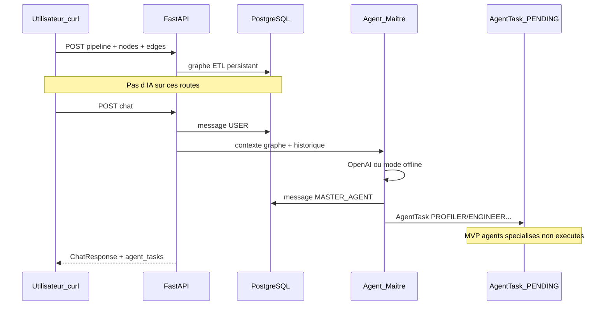

# Workflow complet — DataPipe avec `curl`

Ce guide enchaîne **toutes les étapes** d’un scénario ETL bancaire typique et montre **comment les agents interviennent** (MVP actuel).

**Prérequis**

```bash
# API démarrée (depuis la racine du projet)
./scripts/run.sh
# ou : uvicorn app.main:app --host 0.0.0.0 --port 8000 --reload

# PostgreSQL + migrations
alembic upgrade head

# Optionnel : jq pour formater le JSON
sudo apt install jq   # ou brew install jq
```

**Variables** (à adapter si vous exposez sur le LAN) :

```bash
export BASE="http://127.0.0.1:8000"
export API="${BASE}/api/v1"
```

---

## Vue d’ensemble du flux



| Phase | Routes | Agents |
|-------|--------|--------|
| 1. Santé | `GET /health` | Aucun |
| 2. Projet | `POST /pipelines` | Aucun |
| 3. Canvas | `POST/PATCH nodes`, `POST edges` | Aucun |
| 4. Lecture | `GET /pipelines/{id}` | Aucun |
| 5. Orchestration IA | `POST /chat` | **Agent Maître** + délégation |
| 6. Historique | `GET /chat` | Aucun (lecture seule) |

En **MVP**, seul l’**Agent Maître** répond. Les agents spécialisés (Profiler, Engineer, etc.) reçoivent des **`AgentTask` en statut `PENDING`** — ils ne s’exécutent pas encore automatiquement.

---

## Étape 0 — Vérifier que l’API répond

```bash
curl -s "${BASE}/health" | jq .
```

**Attendu**

```json
{ "status": "ok" }
```

---

## Étape 1 — Créer un pipeline (projet ETL)

```bash
curl -s -X POST "${API}/pipelines" \
  -H "Content-Type: application/json" \
  -d '{"name": "Flux transactions bancaires"}' | jq .
```

**Récupérer l’ID** (copier dans votre shell) :

```bash
export PIPELINE_ID=$(curl -s -X POST "${API}/pipelines" \
  -H "Content-Type: application/json" \
  -d '{"name": "Flux transactions bancaires"}' | jq -r '.id')

echo "PIPELINE_ID=$PIPELINE_ID"
```

**Agents** : aucun. Données en base uniquement.

---

## Étape 2 — Construire le graphe (3 nœuds)

### 2a. Source CSV

```bash
curl -s -X POST "${API}/pipelines/${PIPELINE_ID}/nodes" \
  -H "Content-Type: application/json" \
  -d '{
    "type": "SOURCE",
    "subtype": "csv",
    "label": "Transactions CSV",
    "position": { "x": 0, "y": 100 },
    "data": { "file": "transactions_2024.csv", "delimiter": ";" },
    "status": "IDLE"
  }' | jq .
```

```bash
export NODE_SOURCE=$(curl -s -X POST "${API}/pipelines/${PIPELINE_ID}/nodes" \
  -H "Content-Type: application/json" \
  -d '{
    "type": "SOURCE",
    "subtype": "csv",
    "label": "Transactions CSV",
    "position": { "x": 0, "y": 100 },
    "data": { "file": "transactions_2024.csv" }
  }' | jq -r '.id')
echo "NODE_SOURCE=$NODE_SOURCE"
```

### 2b. Transformation (script Python)

```bash
export NODE_TRANSFORM=$(curl -s -X POST "${API}/pipelines/${PIPELINE_ID}/nodes" \
  -H "Content-Type: application/json" \
  -d '{
    "type": "TRANSFORM",
    "subtype": "python_script",
    "label": "Nettoyage montants",
    "position": { "x": 300, "y": 100 },
    "data": { "code": "# pandas: normaliser devise, supprimer doublons" },
    "status": "IDLE"
  }' | jq -r '.id')
echo "NODE_TRANSFORM=$NODE_TRANSFORM"
```

### 2c. Destination (sink Postgres)

```bash
export NODE_SINK=$(curl -s -X POST "${API}/pipelines/${PIPELINE_ID}/nodes" \
  -H "Content-Type: application/json" \
  -d '{
    "type": "SINK",
    "subtype": "postgres_sink",
    "label": "DWH fact_transactions",
    "position": { "x": 600, "y": 100 },
    "data": { "table": "fact_transactions" },
    "status": "IDLE"
  }' | jq -r '.id')
echo "NODE_SINK=$NODE_SINK"
```

**Agents** : aucun. Chaque `POST` émet un événement WebSocket `node.created` (si un client WS est connecté).

---

## Étape 3 — Relier les nœuds (flux de données)

```bash
curl -s -X POST "${API}/pipelines/${PIPELINE_ID}/edges" \
  -H "Content-Type: application/json" \
  -d "{\"source_node_id\": \"${NODE_SOURCE}\", \"target_node_id\": \"${NODE_TRANSFORM}\"}" | jq .

curl -s -X POST "${API}/pipelines/${PIPELINE_ID}/edges" \
  -H "Content-Type: application/json" \
  -d "{\"source_node_id\": \"${NODE_TRANSFORM}\", \"target_node_id\": \"${NODE_SINK}\"}" | jq .
```

**Agents** : aucun.

---

## Étape 4 — Vérifier le graphe complet (ReactFlow)

```bash
curl -s "${API}/pipelines/${PIPELINE_ID}" | jq .
```

**Vérifications**

- `nodes` : 3 entrées avec `position`, `type`, `subtype`
- `edges` : 2 entrées `source` → `target`
- `status` du pipeline : `DRAFT`

---

## Étape 5 — Mettre à jour un nœud (simulation exécution)

Avant de parler à l’IA, on simule qu’un nœud passe en attente de traitement :

```bash
curl -s -X PATCH "${API}/pipelines/${PIPELINE_ID}/nodes/${NODE_TRANSFORM}" \
  -H "Content-Type: application/json" \
  -d '{"status": "PENDING"}' | jq .
```

**Agents** : aucun. WebSocket : `node.updated`.

---

## Étape 6 — Agent Maître : premier message (découverte du graphe)

```bash
curl -s -X POST "${API}/pipelines/${PIPELINE_ID}/chat" \
  -H "Content-Type: application/json" \
  -d '{"content": "Décris mon pipeline ETL et dis-moi ce qui manque pour le lancer."}' | jq .
```

### Ce qui se passe côté serveur

1. Enregistrement du message **USER** en base.
2. Chargement du graphe (`nodes`, `edges`) + **20 derniers messages** d’historique.
3. Appel **Agent Maître** :
   - avec `CURSOR_API_KEY` → Cursor Composer (`composer-2.5` par défaut) ;
   - sans clé → **mode offline** (réponse déterministe basée sur le graphe).
4. Enregistrement de la réponse **MASTER_AGENT**.
5. Si la réponse contient un bloc ` ```delegation ` → création d’**`AgentTask`**.
6. Réponse HTTP + événements WS `chat.message` et éventuellement `agent_task.updated`.

### Structure de réponse

```json
{
  "user_message": { "sender": "USER", "content_md": "...", ... },
  "agent_message": { "sender": "MASTER_AGENT", "content_md": "...", "metadata": { ... }, ... },
  "agent_tasks": [ ... ]
}
```

**Inspecter uniquement la réponse agent**

```bash
curl -s -X POST "${API}/pipelines/${PIPELINE_ID}/chat" \
  -H "Content-Type: application/json" \
  -d '{"content": "Décris mon pipeline ETL et dis-moi ce qui manque pour le lancer."}' \
  | jq '.agent_message.content_md'
```

---

## Étape 7 — Déclencher la délégation vers le Profiler (anomalies)

Message conçu pour provoquer une délégation (surtout en **mode offline**) :

```bash
curl -s -X POST "${API}/pipelines/${PIPELINE_ID}/chat" \
  -H "Content-Type: application/json" \
  -d '{"content": "Profile les données du CSV et détecte les anomalies logiques sans règles métier fixes."}' | jq .
```

**Avec OpenAI**, l’Agent Maître peut aussi renvoyer un bloc :

````markdown
```delegation
[{"agent_role": "PROFILER", "instruction": "...", "node_id": null}]
```
````

**Extraire les tâches déléguées**

```bash
curl -s -X POST "${API}/pipelines/${PIPELINE_ID}/chat" \
  -H "Content-Type: application/json" \
  -d '{"content": "Profile les données du CSV et détecte les anomalies."}' \
  | jq '.agent_tasks'
```

**Exemple `agent_tasks` (MVP)**

```json
[
  {
    "id": "uuid-task",
    "pipeline_id": "uuid-pipeline",
    "node_id": null,
    "agent_role": "PROFILER",
    "instruction": "Profile pipeline data per user request: ...",
    "input_payload": {},
    "output_payload": {},
    "status": "PENDING",
    "created_at": "...",
    "completed_at": null
  }
]
```

| Champ | Signification MVP |
|-------|-------------------|
| `agent_role` | `PROFILER`, `ENGINEER`, `DEBUGGER`, `GUARDIAN`, `QA`, `AUDITOR` |
| `status` | Toujours **`PENDING`** — l’agent spécialisé **ne s’exécute pas** encore |
| `node_id` | Nœud cible optionnel (ex. lier au `NODE_SOURCE`) |
| `output_payload` | Vide tant que l’agent n’a pas tourné (phase 2) |

---

## Étape 8 — Délégation Ingénieur (transformation de code)

```bash
curl -s -X POST "${API}/pipelines/${PIPELINE_ID}/chat" \
  -H "Content-Type: application/json" \
  -d "{\"content\": \"Génère un script pandas pour nettoyer les montants sur le nœud transform.\", \"node_id\": \"${NODE_TRANSFORM}\"}" | jq '.agent_tasks'
```

> **Note** : le corps accepté par l’API est seulement `{"content": "..."}`. Pour lier une tâche à un nœud en MVP, l’Agent Maître doit inclure `"node_id": "<uuid>"` dans le JSON de délégation. Vous pouvez le demander explicitement dans le texte :

```bash
curl -s -X POST "${API}/pipelines/${PIPELINE_ID}/chat" \
  -H "Content-Type: application/json" \
  -d "{\"content\": \"Délègue à ENGINEER la génération du script pandas pour le nœud ${NODE_TRANSFORM}.\"}" | jq .
```

---

## Étape 9 — Historique du chat (suivi des échanges)

```bash
curl -s "${API}/pipelines/${PIPELINE_ID}/chat" | jq .
```

**Agents** : lecture seule. Vous voyez toute la conversation USER ↔ MASTER_AGENT et les métadonnées (`delegations`, `requires_user_input`).

**Filtrer les messages de l’Agent Maître**

```bash
curl -s "${API}/pipelines/${PIPELINE_ID}/chat" \
  | jq '[.[] | select(.sender == "MASTER_AGENT") | {created_at, content_md, metadata}]'
```

---

## Étape 10 — Enregistrer le design DWH (sans IA)

```bash
curl -s -X PATCH "${API}/pipelines/${PIPELINE_ID}" \
  -H "Content-Type: application/json" \
  -d '{
    "status": "ACTIVE",
    "architecture_design": {
      "model_type": "STAR",
      "scd_type": "TYPE_2",
      "target_tables": ["fact_transactions", "dim_client"],
      "justification": "Modèle en étoile pour reporting bancaire OLAP"
    }
  }' | jq '{id, name, status, architecture_design}'
```

**Agents** : aucun.

---

## Étape 11 — Liste des pipelines

```bash
curl -s "${API}/pipelines" | jq .
```

---

## Étape 12 — Nettoyage (optionnel)

```bash
# Supprimer une liaison
export EDGE_ID=$(curl -s "${API}/pipelines/${PIPELINE_ID}" | jq -r '.edges[0].id')
curl -s -X DELETE "${API}/pipelines/${PIPELINE_ID}/edges/${EDGE_ID}" -w "\nHTTP %{http_code}\n"

# Supprimer tout le projet
curl -s -X DELETE "${API}/pipelines/${PIPELINE_ID}" -w "\nHTTP %{http_code}\n"
```

---

## Script tout-en-un (copier-coller)

En supposant que le pipeline n’existe pas encore :

```bash
#!/usr/bin/env bash
set -euo pipefail
BASE="${BASE:-http://127.0.0.1:8000}"
API="${BASE}/api/v1"

echo "=== Health ==="
curl -sf "${BASE}/health" | jq .

echo "=== Create pipeline ==="
PIPELINE_ID=$(curl -sf -X POST "${API}/pipelines" \
  -H "Content-Type: application/json" \
  -d '{"name":"Demo curl agents"}' | jq -r '.id')
echo "PIPELINE_ID=$PIPELINE_ID"

echo "=== Nodes ==="
NODE_SOURCE=$(curl -sf -X POST "${API}/pipelines/${PIPELINE_ID}/nodes" \
  -H "Content-Type: application/json" \
  -d '{"type":"SOURCE","subtype":"csv","label":"CSV","position":{"x":0,"y":0}}' | jq -r '.id')
NODE_TRANSFORM=$(curl -sf -X POST "${API}/pipelines/${PIPELINE_ID}/nodes" \
  -H "Content-Type: application/json" \
  -d '{"type":"TRANSFORM","subtype":"python_script","label":"Transform","position":{"x":250,"y":0}}' | jq -r '.id')
NODE_SINK=$(curl -sf -X POST "${API}/pipelines/${PIPELINE_ID}/nodes" \
  -H "Content-Type: application/json" \
  -d '{"type":"SINK","subtype":"postgres_sink","label":"Sink","position":{"x":500,"y":0}}' | jq -r '.id')

echo "=== Edges ==="
curl -sf -X POST "${API}/pipelines/${PIPELINE_ID}/edges" \
  -H "Content-Type: application/json" \
  -d "{\"source_node_id\":\"${NODE_SOURCE}\",\"target_node_id\":\"${NODE_TRANSFORM}\"}" | jq -c .
curl -sf -X POST "${API}/pipelines/${PIPELINE_ID}/edges" \
  -H "Content-Type: application/json" \
  -d "{\"source_node_id\":\"${NODE_TRANSFORM}\",\"target_node_id\":\"${NODE_SINK}\"}" | jq -c .

echo "=== Graph ==="
curl -sf "${API}/pipelines/${PIPELINE_ID}" | jq '{name, nodes: [.nodes[].label], edges: .edges}'

echo "=== Chat: describe pipeline ==="
curl -sf -X POST "${API}/pipelines/${PIPELINE_ID}/chat" \
  -H "Content-Type: application/json" \
  -d '{"content":"Décris ce pipeline."}' \
  | jq '{agent: .agent_message.content_md[0:200], tasks: .agent_tasks}'

echo "=== Chat: trigger PROFILER delegation ==="
curl -sf -X POST "${API}/pipelines/${PIPELINE_ID}/chat" \
  -H "Content-Type: application/json" \
  -d '{"content":"Profile les données et détecte les anomalies."}' \
  | jq '{agent_tasks, metadata: .agent_message.metadata}'

echo "=== Chat history ==="
curl -sf "${API}/pipelines/${PIPELINE_ID}/chat" | jq 'length'
echo "Done. PIPELINE_ID=$PIPELINE_ID"
```

Sauvegarde possible : `scripts/demo_workflow.sh`

---

## Tableau des agents (MVP vs futur)

| Agent | Rôle prévu | Déclenché par | Statut MVP | Exécution MVP |
|-------|-------------|---------------|------------|----------------|
| **MASTER** | Chat, orchestration | `POST /chat` | Actif | OpenAI ou offline |
| **PROFILER** | Audit données, anomalies | Délégation Maître | `PENDING` | Non |
| **ENGINEER** | Code pandas/SQL | Délégation Maître | `PENDING` | Non |
| **DEBUGGER** | Correction auto | Boucle phase 2 | — | Non |
| **GUARDIAN** | PII, validation humaine | Délégation Maître | `PENDING` | Non |
| **QA** | OLAP slice/dice | Délégation Maître | `PENDING` | Non |
| **AUDITOR** | Rapport LaTeX/PDF | Délégation Maître | `PENDING` | Non |

**Comment voir l’orchestration aujourd’hui**

1. `POST /chat` → champ `agent_tasks` dans la réponse.
2. `GET /chat` → historique + `metadata.delegations` sur les messages Maître.
3. WebSocket `agent_task.updated` (client WS sur `/api/v1/ws/pipelines/{id}`).

Il n’existe **pas encore** de route `GET /agent_tasks` ; les tâches sont renvoyées au moment du chat.

---

## Dépannage curl

| Erreur | Cause probable |
|--------|----------------|
| `Connection refused` | API non démarrée ou mauvais `BASE` |
| `404 Pipeline not found` | `PIPELINE_ID` incorrect |
| `422` | JSON invalide (guillemets, UUID) |
| `agent_tasks: []` | Maître n’a pas délégué ; reformuler (« profile », « anomalies ») |
| Réponse offline | Pas de `CURSOR_API_KEY` — voir [CURSOR_API_KEYS.md](CURSOR_API_KEYS.md) |
| Message `⚠️ Erreur Cursor` | Clé, bridge CLI, ou quota — plus de 500 brut |

---

## Voir aussi

- [API_ROUTES.md](API_ROUTES.md) — référence de toutes les routes
- [EXPOSITION_RESEAU.md](EXPOSITION_RESEAU.md) — partager l’API avec des collègues
